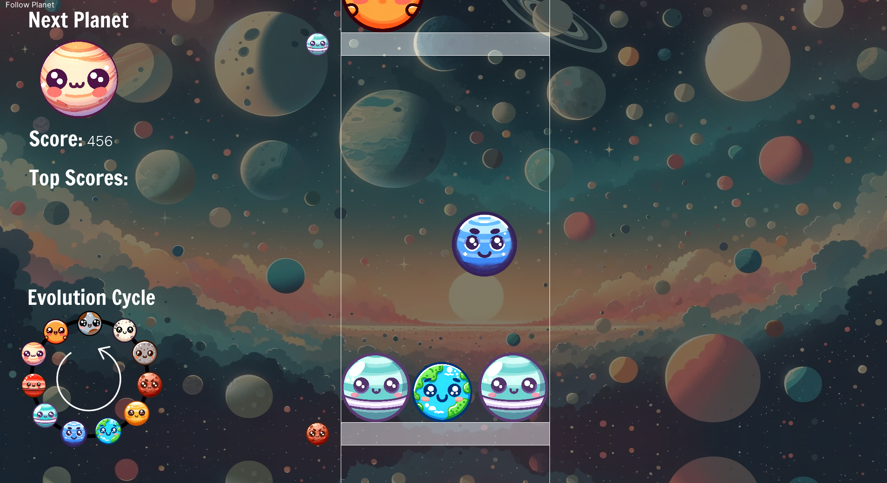

# Ginga Game

Welcome to Ginga Game, a cosmic spin on the classic Suika game implemented using MonoGame! Rather than combining fruits, you'll be colliding and merging planets in this strategic game set in the cosmos.

## Game Modes

The game offers two interesting modes to test your strategics skills:

### Game Mode 1

In this mode, players strategically drop planets into a container, aiming to collide planets of the same type to merge them into new, larger planets. The game mimics an evolutionary hierarchy, where players start with the smallest planets and aim to combine them sequentially until a sun is formed. Winning the game requires merging two of the largest planets to form a sun, while losing happens when a planet reaches the end of the container, similar to Tetris.

### Game Mode 2

This mode, known as 'Reverse Evolution', challenges players in a different way. The game begins with a sun and the player's objective is to combine planets to shrink them. Gameplay takes place across a multi-floor container, where each floor has a set limit on the size of planets it will allow. Therefore, players should aim to combine larger planets into smaller ones that can be accepted on the next floor. Game progression happens from one floor to the next, with the aim of reaching the smallest planet at the bottom-most floor to win the game.

Enjoy this strategic, cosmic adventure!